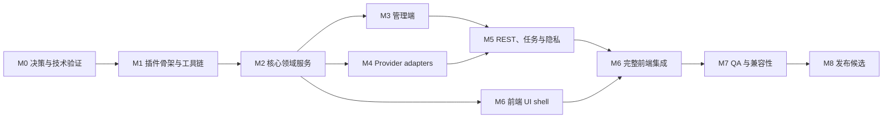

# WooCommerce AI Virtual Try-On — Development Plan

> Status: Execution — M0/G0 through M3/G3, M5/G5, and M6/G6 completed; M4 offline contract passed with live G4 deferred; M7/G7 and final G8 remain blocked by external compatibility/provider evidence on 2026-08-09  
> Date: 2026-08-08  
> Source requirements: `sea-tryon-doc/REQUIREMENTS.md` Draft v0.2  
> Target release: MVP 1.0.0  
> Default UI/source language: English  
> Plugin slug: `sea-tryon`; text domain: `seatryon-ai-virtual-try-on-for-woocommerce`

> Execution records: [`m0/M0-GATE-REPORT.md`](m0/M0-GATE-REPORT.md), [`m1/M1-GATE-REPORT.md`](m1/M1-GATE-REPORT.md), [`m2/M2-GATE-REPORT.md`](m2/M2-GATE-REPORT.md), [`m3/M3-GATE-REPORT.md`](m3/M3-GATE-REPORT.md), [`m4/M4-GATE-REPORT.md`](m4/M4-GATE-REPORT.md), [`m5/M5-GATE-REPORT.md`](m5/M5-GATE-REPORT.md), [`m6/M6-GATE-REPORT.md`](m6/M6-GATE-REPORT.md), and [`m7/M7-GATE-REPORT.md`](m7/M7-GATE-REPORT.md).

## 1. 计划目的

本文把需求规格拆分为可执行的开发阶段、任务依赖、交付物、测试门禁和发布条件。范围仅覆盖 MVP，不包含实时 AR、视频、多结果、账户历史、自动 Provider 故障转移或 Media Library 存储。

插件入口、生产模块、动态 block、Composer/npm 工具链、自动化测试和 CI 均已落地；本文同时保留原始任务分解和每个 gate 的执行记录。

## 2. 开发基线

### 2.1 兼容目标

- WordPress 6.9+；本地环境为 7.0.2。
- WooCommerce 10.9+；本地环境为 10.9.4；发布前额外验证 WooCommerce 11.x。
- PHP 7.4+；本地可运行 PHP 7.4.16 与 8.3.1。
- 前端：当前及前一个主要版本的 Chrome、Edge、Firefox、Safari；iOS Safari 与 Android Chrome。
- 后台产品配置：Classic Product Editor。
- 前端：classic theme、block theme、Site Editor、Single Product/Add to Cart blocks。

### 2.2 当前工具状态

| Tool | Status | Plan |
| --- | --- | --- |
| Git | Available | 在编码前确认/初始化仓库与忽略规则。 |
| PHP CLI | MAMP 内可用，但未加入 PATH | 测试命令显式使用 PHP 7.4/8.3 路径或配置项目脚本。 |
| Composer | Not available | M1 安装项目可用的 Composer，并锁定 dev dependencies。 |
| Node | 24.13.0 | 可用。 |
| npm | 11.6.2；PowerShell `.ps1` 被策略阻止 | 使用 `npm.cmd` 或项目 task wrapper。 |
| WP-CLI | Not available | M1 配置；若暂不使用，自动化测试改用 wp-env/QIT。 |
| Existing tests/build | None | M1 建立 PHPCS、PHPUnit、JS lint/build、E2E。 |

### 2.3 已确认产品决策

- OpenAI GPT Image 2 与 SeaAI Universal X 二选一。
- OpenAI 使用 `gpt-image-2` Image Edit contract。
- SeaAI 使用 `universal_x`，默认 `quality=low`。
- 支持人物试穿/试戴和家具/一般商品场景融合。
- 访客访问可开关，登录用户与访客每日限额分别配置。
- 结果不创建 attachment，不进入 Media Library。
- 不集成已退役的 WooCommerce Product Editor Beta。

### 2.4 暂定默认值

在产品决策未进一步修改前，开发与测试使用：

- Allow Guest Try-On：Off；开启后访客限额才生效。
- Logged-in daily limit：3。
- Guest daily limit：3。
- 拥有 `manage_options` 权限的管理员：不限生成次数。
- 每任务输出：1 张，可下载。
- 本地临时数据 TTL：24 小时。
- OpenAI quality：`low`。
- SeaAI quality：`low`。

这些值必须集中定义，不能散落为 magic values，便于需求确认后一次修改。

## 3. 实施原则

1. 单一 `sea-tryon.php` bootstrap；文件加载阶段不执行重业务。
2. 使用 PHP namespace `SeaTryOn\` 与小型、职责单一的 service/controller。
3. 设置优先使用 WooCommerce Settings API；不创建品牌顶级菜单。
4. 产品字段使用 WooCommerce Classic Product Editor 公共 hooks。
5. REST 使用 `WP_REST_Controller`、JSON schema、显式 `permission_callback`。
6. 浏览器不直接调用 OpenAI/SeaAI，API Key 永远留在服务器端。
7. 任务统一异步化；Provider 即使同步返回，前端也只观察 job 状态。
8. 后台任务使用 WooCommerce Action Scheduler 公共 API，任务必须幂等。
9. MVP 不创建自定义业务表；先以 options/meta/transients/临时文件实现，并通过并发与容量测试验证。
10. 前端 UI 先满足无障碍和响应式，再添加非必要动画。
11. 所有源字符串先写英文，并使用 `seatryon-ai-virtual-try-on-for-woocommerce` text domain。
12. 每个里程碑只有在其质量门禁通过后才能进入下一阶段。

## 4. 总体依赖关系



M3、M4 和 M6 的 UI shell 可在 M2 contract 稳定后并行；M5 必须等待设置、Provider interface 和 job contract 稳定。

## 5. 里程碑概览

| Milestone | Outcome | Estimate | Exit gate |
| --- | --- | ---: | --- |
| M0 | 关键决策、Provider 与存储技术验证 | 2–3 人日 | G0 技术方案通过 |
| M1 | 可激活插件骨架、构建和测试工具链 | 3–4 人日 | G1 基础质量通过 |
| M2 | 核心 contracts、job/quota/storage 基础 | 4–5 人日 | G2 单元测试通过 |
| M3 | WooCommerce 设置与产品字段 | 3–4 人日 | G3 管理端验收通过 |
| M4 | OpenAI 与 SeaAI adapters | 6–7 人日 | G4 Provider contract 通过 |
| M5 | REST、Action Scheduler、安全和清理 | 7–8 人日 | G5 API/隐私门禁通过 |
| M6 | 产品页按钮、模态框与结果体验 | 5–6 人日 | G6 E2E/无障碍通过 |
| M7 | 安全、兼容性、性能与回归 QA | 7–8 人日 | G7 Release readiness 通过 |
| M8 | 文档、构建包与 1.0.0 RC | 2–3 人日 | G8 可发布 |

单名有经验的 WordPress/WooCommerce 开发者加兼职 QA，预计 **39–48 人日**，约 **8–10 个日历周**。Provider 凭证等待、SeaAI query contract 补充、Marketplace/WordPress.org 审核时间不计入估算。两名开发者可在 M2 后并行 M3/M4/M6，将日历时间缩短到约 **5–7 周**，但不会减少总人日。

## 6. 详细工作分解

### M0 — 决策与技术验证

目标：在搭建正式架构前消除会导致返工的接口、存储和前端挂载风险。

| ID | Task | Deliverable | Depends | Estimate |
| --- | --- | --- | --- | ---: |
| M0-01 | 冻结暂定默认值或记录可变项 | Decision log / ADR-001 | Requirements v0.2 | 0.25d |
| M0-02 | 登记 OpenAI/SeaAI 测试凭证获取路径；凭证可用时执行 smoke test | Credential readiness / 脱敏连通性结果 | User credentials | 0.25d |
| M0-03 | 确认 SeaAI `/forward/image/query` contract，或确认同步-only | ADR-002 + mock fixtures | SeaAI owner | 0.5d |
| M0-04 | 验证 GPT Image 2 多图 edit 与 SeaAI upload/generate 的最小请求 | 不进入插件的 spike 与响应 fixtures | M0-02 | 0.75d |
| M0-05 | 验证私有临时目录、Action Scheduler 进程和 REST 请求可访问同一文件 | Storage ADR-003 | Local/staging env | 0.5d |
| M0-06 | 验证 classic 与 block product page 的自动按钮挂载点 | Frontend integration ADR-004 | WC 10.9/11.x env | 0.5d |

#### G0 — 技术方案门禁

- OpenAI 和 SeaAI 至少有可重复的 mock contract；真实凭证可以延后，但必须有负责人和交付时间。
- SeaAI 异步路径有正式 contract，或明确首发只支持同步 `images`。
- 临时文件位置不需要公开 URL，并能跨 job/REST 请求读取。
- block product page 有受支持的自动挂载方案；若无，批准动态 block fallback。
- 未确认项都有负责人、默认值和最晚确认里程碑。

### M1 — 插件骨架与工具链

目标：建立可以安全激活、持续构建、持续测试的最小插件。

| ID | Task | Deliverable | Depends | Estimate |
| --- | --- | --- | --- | ---: |
| M1-01 | 创建主插件文件、header、常量和 bootstrap | `sea-tryon.php` | G0 | 0.5d |
| M1-02 | 建立 PSR-4/autoload 与模块目录 | `composer.json`, `src/Plugin.php` | M1-01 | 0.5d |
| M1-03 | WooCommerce 依赖/版本检查与管理通知 | Dependency service | M1-01 | 0.5d |
| M1-04 | Activation/deactivation/uninstall skeleton | Lifecycle classes, `uninstall.php` | M1-01 | 0.25d |
| M1-05 | PHP 工具链 | PHPCS/WPCS, PHPUnit, PHPStan level baseline | M1-02 | 0.5d |
| M1-06 | JS/CSS 工具链 | `package.json`, `@wordpress/scripts`, build/lint | M1-01 | 0.5d |
| M1-07 | 测试环境与基础 CI scripts | wp-env/MAMP scripts, PHP 7.4/8.3 matrix | M1-05/06 | 0.5d |
| M1-08 | 初始 readme、changelog、license、`.distignore` | Release skeleton | M1-01 | 0.25d |

#### G1 — 基础质量门禁

- 插件在 WooCommerce 启用/未启用两种情况下无 fatal。
- `phpcs`, PHPUnit smoke test、JS lint、`npm run build` 可执行。
- PHP 7.4 与 8.3 语法检查通过。
- 生产包不包含测试 fixture、源码 map、开发凭证或无关文档。
- 重新执行项目 triage 后识别为 `wp-plugin`；如加入 block，识别为 `wp-block-plugin`。

### M2 — 核心领域服务

目标：先稳定 contract，再由管理端、Provider、REST 和前端分别实现。

| ID | Task | Deliverable | Depends | Estimate |
| --- | --- | --- | --- | ---: |
| M2-01 | Settings repository 与 typed getters | `SettingsRepository` | G1 | 0.5d |
| M2-02 | API Key masking、constant/filter override、redaction | `SecretStore`, `Redactor` | M2-01 | 0.5d |
| M2-03 | Provider interface 与 request/result DTO | `ProviderInterface`, DTOs | G1 | 0.5d |
| M2-04 | Experience Type 与 Prompt composer | `PromptComposer` + templates | M2-03 | 0.5d |
| M2-05 | Job 状态机与 idempotency contract | `Job`, `JobService` | G1 | 0.75d |
| M2-06 | 临时文件 storage interface 与 private implementation | `TemporaryStorage` | ADR-003 | 0.75d |
| M2-07 | Quota identity、计数与原子锁 contract | `QuotaService`, `Lock` | G1 | 0.75d |
| M2-08 | WooCommerce logger wrapper | `Logger` | M2-02 | 0.25d |

#### 核心设计约束

- Job ID 使用至少 128-bit CSPRNG；状态转换只能沿合法路径进行。
- 对同一 idempotency key 重放创建请求时返回原 job，不重复计费或计数。
- Quota 只在 Provider 请求被实际派发后扣减。
- 并发限额操作使用短 TTL 的原子锁；首选 `add_option()`/`wp_cache_add()` 的原子 add 语义，并测试持久对象缓存存在/不存在两种情况。
- 临时文件默认位于 `get_temp_dir()` 下的站点隔离目录；若解析路径处于公开 web root 且无法可靠阻止直连，必须 fail closed 并提示管理员，不以公开 uploads URL 降级。
- 所有 services 依赖 interface，以便 unit tests 注入 clock、HTTP client、storage 和 scheduler doubles。

#### G2 — 核心门禁

- Prompt、job 状态机、quota 边界、幂等、redaction、TTL 单元测试通过。
- 不含 WordPress/WooCommerce 的纯领域代码可独立测试。
- 无 API Key、图片数据或 token 进入测试日志。
- ADR-001 至 ADR-004 已提交并与需求一致。

### M3 — WooCommerce 管理端

目标：完成商家全局设置、产品配置、统计和安全保存。

| ID | Task | Deliverable | Depends | Estimate |
| --- | --- | --- | --- | ---: |
| M3-01 | Products > Virtual Try-On settings section | `SettingsPage` | M2-01 | 0.75d |
| M3-02 | Provider 条件字段、Key masking、quality 和限额字段 | Settings fields/sanitizers | M2-01/02 | 0.75d |
| M3-03 | Debug Mode、统计、Reset Statistics | Admin actions + nonce/capability | M2-08 | 0.5d |
| M3-04 | Classic Product Editor 字段 | Enable, Prompt, Experience Type | M2-04 | 0.75d |
| M3-05 | 产品保存验证与 inline notice | Validation/save hooks | M3-04 | 0.5d |
| M3-06 | WooCommerce 缺失、配置不完整、temp 不可写 notices | Admin notices | M1-03/M2-06 | 0.5d |
| M3-07 | i18n、键盘和 responsive admin QA | POT-ready admin strings | M3-01..06 | 0.25d |

#### 计划使用的公开 hooks/API

- `woocommerce_settings_sections_registration` 或兼容目标所支持的 WooCommerce settings section API。
- Classic editor：`woocommerce_product_options_advanced`。
- 保存：`woocommerce_admin_process_product_object`。
- 权限：`manage_woocommerce`；产品保存同时检查对象编辑权限和 nonce。
- 不使用 `Automattic\WooCommerce\Internal` 或 Product Editor Beta APIs。

#### G3 — 管理端门禁

- 非授权用户不能读取/修改设置或重置统计。
- 空白 Key 提交不会误删已保存 Key；完整 Key 不回显。
- 两个 Provider 字段互斥，隐藏字段不会污染另一 Provider 配置。
- Simple/variable product 的 meta 保存、读取和验证通过。
- WP_DEBUG 下无 notice/deprecation。

### M4 — Provider adapters

目标：实现互斥、可测试且错误语义一致的 OpenAI/SeaAI 接入。

| ID | Task | Deliverable | Depends | Estimate |
| --- | --- | --- | --- | ---: |
| M4-01 | WordPress HTTP client wrapper | Timeout, headers, safe JSON/download | M2-03 | 0.5d |
| M4-02 | 安全 multipart encoder | 多个 `image[]` 与单文件 upload | M4-01 | 0.75d |
| M4-03 | OpenAI GPT Image 2 adapter | `/v1/images/edits`, base64 result | M4-02 | 1.0d |
| M4-04 | OpenAI error/moderation mapping | Stable plugin errors | M4-03 | 0.5d |
| M4-05 | SeaAI upload adapter | `/forward/image/upload` | M4-02 | 0.75d |
| M4-06 | SeaAI generate adapter | `universal_x`, quality low | M4-05 | 0.75d |
| M4-07 | SeaAI query adapter | `/forward/image/query` | M0-03/M4-06 | 0.5d |
| M4-08 | SSRF/remote result validation | Allowlist, DNS/IP/size/content checks | M4-01 | 0.75d |
| M4-09 | Retry/backoff and request correlation | Bounded retries + request IDs | M4-03/06 | 0.5d |
| M4-10 | Provider contract tests | Mock fixtures for all status/error paths | M4-03..09 | 0.75d |

#### OpenAI adapter implementation notes

- 固定 `model=gpt-image-2`，调用 `/v1/images/edits`。
- multipart 中第一张为顾客/场景图，第二张为可信产品图。
- `n=1`, `size=auto`, `background=auto`, `output_format=png`；quality 来自白名单设置。
- 不发送 `input_fidelity`；GPT Image 2 自动以 high fidelity 处理输入。
- 严格校验 `data[0].b64_json` 的 base64、解码大小、MIME 和可解码性。
- 总任务预算覆盖接近 2 分钟的模型延迟，但 PHP 页面请求不直接等待。

#### SeaAI adapter implementation notes

- Base URL 必须为 HTTPS，并规范化为 `/wp-json/seaai/v1` root。
- 每张输入先通过 `/forward/image/upload` 获得 `download_url`。
- Generate 固定 `model_name=universal_x`, `n=1`, `quality=low` 默认值。
- Universal X 在本项目中仅支持同步 `images`；任何 `task_id` 都按 Provider contract drift 失败并保留脱敏内部诊断，不调用 legacy query route。
- 400/401/402/403 不自动重试；网络/502/503 才做有限 backoff。
- 不接收或存储上游 Universal X Provider Key。

#### G4 — Provider contract 门禁

- 每个 adapter 在无外网 unit/contract test 中覆盖成功、超时、畸形响应和全部规定错误。
- staging 上两种 Provider 各完成一次人物模式和一次场景模式生成。
- 选择一个 Provider 时不会访问另一 Provider 或读取其 Key。
- 日志和异常中不存在 Authorization、图片/base64、可访问结果 URL。
- OpenAI implementation 与 [官方 GPT Image 2 模型页](https://developers.openai.com/api/docs/models/gpt-image-2) 的 edit capability 一致。

### M5 — REST、任务、安全与隐私

目标：建立访客和登录用户均安全可用的异步任务生命周期。

| ID | Task | Deliverable | Depends | Estimate |
| --- | --- | --- | --- | ---: |
| M5-01 | `WP_REST_Controller` 与 job schema | `sea-tryon/v1` controller | M2/M3 | 0.75d |
| M5-02 | POST `/jobs` | Upload, consent, product, quota validation | M5-01/M4 | 1.0d |
| M5-03 | GET status/result + DELETE | Ownership-checked endpoints | M5-01/M2-06 | 0.75d |
| M5-04 | 登录用户 authentication | Cookie auth + `X-WP-Nonce` | M5-01 | 0.5d |
| M5-05 | 访客 session 与短期签名 token | HttpOnly cookie + HMAC token | M5-01 | 0.75d |
| M5-06 | 服务端图片验证与 resize/orientation | Upload pipeline | M2-06 | 0.75d |
| M5-07 | Action Scheduler worker | Dispatch, query, retry, idempotency | M2-05/M4 | 1.0d |
| M5-08 | Result streaming/download | Authenticated PHP stream | M5-03/M2-06 | 0.5d |
| M5-09 | TTL cleanup、取消、停用和卸载 | Scheduled cleanup/lifecycle | M1-04/M2-06 | 0.75d |
| M5-10 | Privacy Policy Guide 与 exporter/eraser hooks | Privacy integration | M5-02/09 | 0.5d |

#### REST 与访客安全设计

- 所有 routes 声明 schema、args、HTTP method、`permission_callback` 和明确 status。
- 登录用户：标准 WordPress cookie auth + `wp_rest` nonce，再做 job ownership 校验。
- 访客：高熵 HttpOnly session cookie；页面输出短期 HMAC action token，绑定 session、product ID、expiry 和 action。
- 访客 token 不是共享的 logged-out WordPress nonce；服务端同时验证 Origin/Referer、session、签名、过期时间和 quota。
- Job status/result/delete 必须验证 owner hash，不能只依赖不可猜 job ID。
- 图片只从 `WP_REST_Request` 的 file params 和服务端产品 attachment 读取。
- Result 由 REST/PHP 流式输出，设置 `Content-Disposition`, `Content-Type`, `X-Content-Type-Options: nosniff` 和 no-store cache headers。

#### G5 — API 与隐私门禁

- `/wp-json/` 可发现 namespace，OPTIONS 返回 schema。
- 401/403/404/413/422/429/502/503 行为与 requirements 一致。
- 越权 job ID、过期 token、跨 session、重放和并发绕限额测试通过。
- 输入/结果不进入 Media Library，不存在可枚举公开 URL。
- TTL、DELETE、失败、停用、卸载都能清理相关临时个人数据。
- Action Scheduler 重复执行不会重复扣额度、重复计数或重复调用 Provider。

### M6 — 产品页与顾客体验

目标：完成自动显示入口、上传、生成状态和可访问结果体验。

| ID | Task | Deliverable | Depends | Estimate |
| --- | --- | --- | --- | ---: |
| M6-01 | 可见性规则与 server-rendered button | Shared renderer | M2/M3 | 0.5d |
| M6-02 | Classic product page hook adapter | Automatic placement | M6-01 | 0.5d |
| M6-03 | Block product page adapter | Public hook/filter or dynamic block fallback | ADR-004/M6-01 | 0.75d |
| M6-04 | Accessible modal shell | Focus trap/restore, Escape, labels | M6-01 | 0.75d |
| M6-05 | Upload preview/client preflight | MIME/size/preview/remove | M6-04 | 0.5d |
| M6-06 | REST create/poll/delete client | Job UI state machine | M5 | 0.75d |
| M6-07 | Result/download/retry UX | Success/error states | M6-06 | 0.5d |
| M6-08 | Variation image/state integration | Current variation + invalidation | M6-01/06 | 0.75d |
| M6-09 | Experience Type copy/templates | Person vs scene UI | M2-04/M6-04 | 0.25d |
| M6-10 | Responsive/reduced motion styling | 320px, 200%/400% zoom | M6-04..09 | 0.5d |

#### Block compatibility strategy

1. M0 首先验证 WooCommerce 10.9 与 11.x 的公开 product/add-to-cart 渲染扩展点。
2. Classic 和 block 页面都调用同一个 PHP renderer，避免两套业务判断。
3. 若 block 页面没有稳定自动挂载点，注册动态 block `sea-tryon/virtual-try-on`：
   - `block.json` 使用 `apiVersion: 3`。
   - PHP 通过 `register_block_type_from_metadata()` 注册。
   - 使用 `render`/`render_callback` 和 `get_block_wrapper_attributes()`。
   - block 不保存产品状态，仅在服务端按当前 product context 动态渲染。
4. 动态 block fallback 必须提供模板插入说明；自动插入和手动 block 同时存在时要防止重复按钮。

#### G6 — 前端门禁

- Storefront/classic theme 和 block theme 均自动出现一次按钮。
- simple/variable 产品、人物/场景模式、访客 on/off 均通过 E2E。
- 关闭并重开 modal 能恢复当前 job；variation 改变使旧输入失效。
- 键盘、焦点捕获/恢复、Escape、aria-live 和错误关联通过。
- 320 px、200%/400% zoom、reduced motion 可用。
- 非目标页面不加载前端 bundle；产品首屏不等待 Provider。

### M7 — QA、安全、性能与兼容性

目标：把功能完成提升为可发布质量。

| ID | Task | Deliverable | Depends | Estimate |
| --- | --- | --- | --- | ---: |
| M7-01 | PHP unit/integration coverage | Coverage report | G3–G5 | 1.0d |
| M7-02 | REST/security test suite | Upload/token/SSRF/ownership tests | G5 | 1.0d |
| M7-03 | Playwright E2E matrix | User/admin critical journeys | G6 | 1.0d |
| M7-04 | Accessibility automated/manual | axe/WAVE/NVDA/keyboard report | G6 | 1.0d |
| M7-05 | Compatibility matrix | WP/WC/PHP/theme/browser results | G6 | 1.0d |
| M7-06 | Performance/operational tests | Polling, concurrency, cron, cleanup | G5/G6 | 0.75d |
| M7-07 | QIT and conflict testing | Woo QIT report | M7-05 | 0.75d |
| M7-08 | Bug fix and regression buffer | Release-blocker closure | M7-01..07 | 1.5d |

#### 必测矩阵

| Dimension | Minimum cases |
| --- | --- |
| PHP | 7.4, 8.1, 8.3 |
| WordPress | 6.9, 7.0/current |
| WooCommerce | 10.9, 11.x/current |
| Theme | Storefront, current Woo block theme, 2 common third-party themes |
| Product | Simple, variable with/without variation image |
| User | Guest enabled, guest disabled, logged-in customer, admin |
| Provider | OpenAI, SeaAI synchronous, SeaAI task/query if supported |
| Experience | Clothing/person, glasses/wig/accessory, furniture/scene, general placement |
| Failure | Invalid upload, quota, auth, 402, 429, timeout, 5xx, moderation, cleanup failure |

#### G7 — Release readiness 门禁

- PHPCS、PHPStan、PHPUnit、JS lint/build、E2E、QIT 全部通过。
- WP_DEBUG/SCRIPT_DEBUG 下无 warning、notice、deprecation 和 console error。
- 无 P0/P1 安全、隐私、数据丢失或 accessibility blocker。
- Provider 成功率、P50/P95 延迟和失败分类有 staging 记录。
- 临时数据在 TTL 后实际清除；日志敏感信息扫描为零。
- 兼容声明只覆盖实际通过测试的版本与组件。

### M8 — 文档、打包与发布候选

目标：生成可安装、可审查、可回滚的 1.0.0 release candidate。

| ID | Task | Deliverable | Depends | Estimate |
| --- | --- | --- | --- | ---: |
| M8-01 | Merchant setup/help 文档 | Provider/limit/privacy guide | G7 | 0.5d |
| M8-02 | Privacy policy template 与 data-flow 文档 | Privacy docs | M5-10/G7 | 0.5d |
| M8-03 | `readme.txt`, changelog, POT, screenshots | Release metadata | G7 | 0.5d |
| M8-04 | Reproducible production build | Versioned ZIP + checksum | M8-03 | 0.5d |
| M8-05 | Clean install/upgrade/uninstall smoke | RC test report | M8-04 | 0.5d |
| M8-06 | Rollback/support runbook | Operational handoff | M8-04 | 0.5d |

#### G8 — 可发布门禁

- ZIP 在全新 WordPress 环境可安装、激活、配置和完成两种 Provider 流程。
- ZIP 不含 `.git`, tests, fixtures, source credentials, local logs 或未构建源码。
- 插件 header、readme、WC/WP/PHP compatibility 与测试结果一致。
- 卸载只删除约定数据；临时个人数据和 scheduled actions 无残留。
- 版本号、tag、checksum、changelog 和回滚包齐全。

## 7. 建议目录结构

```text
sea-tryon/
├─ sea-tryon.php
├─ uninstall.php
├─ composer.json
├─ composer.lock
├─ package.json
├─ phpcs.xml.dist
├─ phpstan.neon.dist
├─ phpunit.xml.dist
├─ readme.txt
├─ CHANGELOG.md
├─ src/
│  ├─ Plugin.php
│  ├─ Lifecycle/
│  ├─ Admin/
│  │  ├─ SettingsPage.php
│  │  ├─ ProductFields.php
│  │  └─ Notices.php
│  ├─ Domain/
│  │  ├─ Job.php
│  │  ├─ JobStatus.php
│  │  ├─ ExperienceType.php
│  │  └─ PromptComposer.php
│  ├─ Provider/
│  │  ├─ ProviderInterface.php
│  │  ├─ OpenAIProvider.php
│  │  ├─ SeaAIProvider.php
│  │  └─ ProviderErrorMapper.php
│  ├─ Job/
│  │  ├─ JobService.php
│  │  ├─ JobRepository.php
│  │  └─ JobWorker.php
│  ├─ Quota/
│  ├─ Storage/
│  ├─ Security/
│  ├─ Privacy/
│  ├─ Logging/
│  ├─ Rest/
│  │  └─ JobsController.php
│  └─ Frontend/
│     ├─ ProductRenderer.php
│     └─ Assets.php
├─ blocks/
│  └─ virtual-try-on/          # 仅在 ADR-004 决定需要动态 block 时创建
│     ├─ block.json
│     ├─ index.js
│     └─ render.php
├─ assets/
│  ├─ src/js/
│  ├─ src/css/
│  └─ build/
├─ templates/
├─ tests/
│  ├─ Unit/
│  ├─ Integration/
│  ├─ Contract/fixtures/
│  └─ E2E/
└─ sea-tryon-doc/
```

## 8. 数据与任务生命周期

| Event | Required behavior |
| --- | --- |
| Create request | 验证 product、consent、auth/token、upload、quota；生成 job/idempotency key。 |
| Queued | 保存 owner hash、product/variation、provider、input paths、expiry；安排唯一 Action Scheduler action。 |
| Dispatch | 获取原子锁，再次确认状态；调用当前 Provider；此时扣减 quota。 |
| Processing | 同步 Provider 等待结果；异步 Provider 保存 task ID 并安排 query。 |
| Succeeded | 校验并写入临时 result；递增成功统计一次；删除不再需要的输入。 |
| Failed | 写入稳定 error code；清理输入/部分结果；不可重试错误停止。 |
| Download | 校验 owner/token 后 stream；不暴露磁盘路径。 |
| Delete/cancel | 标记终态、取消相关 actions、立即安排文件清理。 |
| Expire | 清除输入、结果、job/session-related temp data。 |
| Deactivate | 停止新任务，unschedule 自有 actions，清理临时个人数据。 |
| Uninstall | 校验 `WP_UNINSTALL_PLUGIN`，按保留策略删除 options/meta/temp/actions。 |

## 9. 测试与质量命令目标

实际 scripts 在 M1 固化，目标接口如下：

```text
composer lint
composer analyse
composer test:unit
composer test:integration
npm.cmd run lint:js
npm.cmd run lint:css
npm.cmd run build
npm.cmd run test:e2e
npm.cmd run env:start
npm.cmd run env:stop
```

CI 最少包含：

1. PHP 7.4/8.1/8.3 syntax + PHPCS + PHPStan。
2. PHPUnit unit/integration。
3. npm clean install、JS/CSS lint 和 production build。
4. E2E critical path。
5. Release ZIP content audit 与 secret scan。

## 10. 风险登记

| Risk | Impact | Probability | Mitigation | Owner milestone |
| --- | --- | --- | --- | --- |
| SeaAI query contract 缺失 | 异步结果无法完成 | High | M0 前置确认；未确认则同步-only 且显式报错 | M0/M4 |
| Provider 延迟接近 PHP 超时 | 任务中断、重复调用 | High | Action Scheduler、幂等、长任务预算、状态恢复 | M4/M5 |
| 访客绕过额度 | 成本失控 | High | 高熵 session、HMAC、原子锁、额外 abuse signal | M2/M5 |
| 临时图片被公开访问 | 严重隐私事件 | Medium | 非 webroot storage、owner-checked streaming、fail closed | M0/M2/M5 |
| transients 在并发/对象缓存下不一致 | 重复计数或任务丢失 | Medium | 原子 lock、并发测试；失败则通过迁移引入专用表 | M2/M7 |
| block product page 缺少稳定挂载点 | 按钮不显示/重复 | Medium | M0 spike、共享 renderer、动态 block fallback | M0/M6 |
| 多图 prompt 结果不稳定 | 试穿质量差 | Medium | Experience templates、真实商品集评测、Prompt fixtures | M0/M4/M7 |
| API Key 数据库明文风险 | 凭证泄露 | Medium | constant/filter override、autoload off、mask/redact、最小权限 | M2/M3 |
| WP-Cron/Action Scheduler 延迟 | UX 长时间 queued | Medium | 状态说明、staging operational test、manual diagnostic path | M5/M7 |
| PHP 7.4 约束限制依赖 | 安装 fatal | Medium | 无生产第三方依赖或严格锁版本；CI 7.4 gate | M1/M7 |
| Provider 隐私政策变化 | 合规文本过期 | Medium | Provider links/config docs、release checklist review | M8 |

## 11. Definition of Ready

任务进入开发前必须满足：

- 对应 requirement ID、输入输出和错误行为明确。
- 依赖的 interface/schema 已稳定。
- 安全、隐私和日志要求已标注。
- 有可重复的 mock fixture；真实 API 任务另需测试凭证。
- 验收标准可自动化，或明确人工验证方法。
- 不依赖 WooCommerce internal/experimental API。

## 12. Definition of Done

每个任务完成必须满足：

- Code review 完成，代码符合 WordPress/WooCommerce coding standards。
- 输入 validation/sanitization、输出 escaping、capability/nonce/ownership 检查完整。
- 新行为有 unit/integration/E2E 中至少一种自动测试。
- 失败路径和日志已测试，且敏感信息被脱敏。
- 默认英文字符串可翻译，无硬编码用户可见中文。
- WP_DEBUG/SCRIPT_DEBUG 下无新增 warning、notice、deprecation 或 console error。
- 构建产物更新，相关文档/changelog 更新。
- 对应 milestone gate 未留下未登记的 blocker。

## 13. 外部依赖与待确认项

以下事项不阻止 M1/M2 使用 mock 开发，但会阻止 G4 或最终发布：

1. OpenAI 测试 API Key 与组织是否可使用 GPT Image 2。
2. SeaAI Base URL、测试 Key 和 `/forward/image/query` contract。
3. 登录/访客默认限额与 Allow Guest 默认值最终确认。
4. 结果数量、下载行为和 24 小时 TTL 最终确认。
5. 最终插件名、作者、许可证和发布渠道。
6. Provider 隐私政策链接与数据保留说明。

## 14. 首发后 P1 Backlog

- Variation 级开关、Prompt 和 Experience Type override。
- HEIC/HEIF 转换。
- 商家自定义按钮文字、位置和基础样式。
- 多结果候选图。
- 登录用户历史结果与 WordPress exporter/eraser 扩展。
- 按日/产品/Provider 的用量报表。
- 管理端 Provider connectivity/diagnostic tool。
- 可选外部对象存储，支持多节点 WordPress。
- Provider adapter registry，允许第三方扩展但保持安全 contract。

## 15. 参考资料

- `sea-tryon-doc/REQUIREMENTS.md`
- external SeaAI Universal X contract reference (local path intentionally omitted)
- external SeaAI Universal X contract reference (local path intentionally omitted)
- [OpenAI GPT Image 2 model](https://developers.openai.com/api/docs/models/gpt-image-2)
- [OpenAI Image generation guide](https://developers.openai.com/api/docs/guides/image-generation)
- `sea-tryon-doc/官方开发规范/`